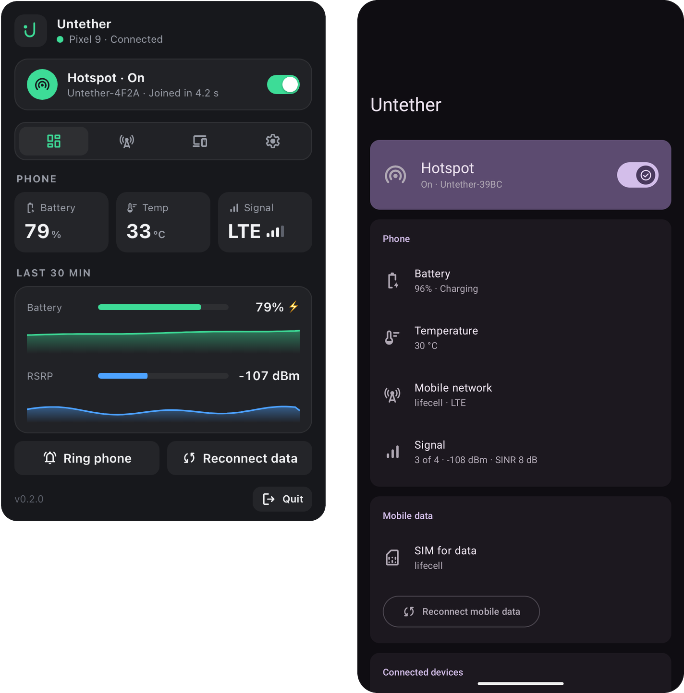
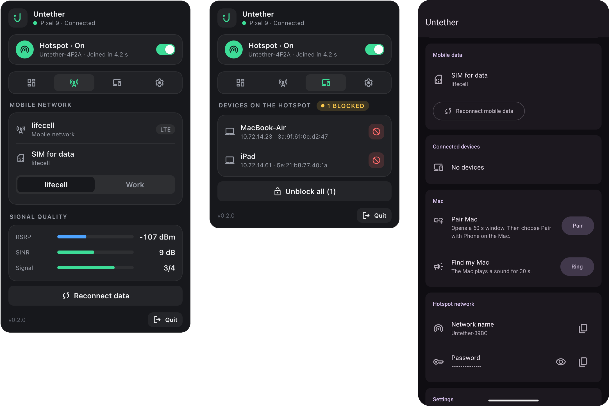
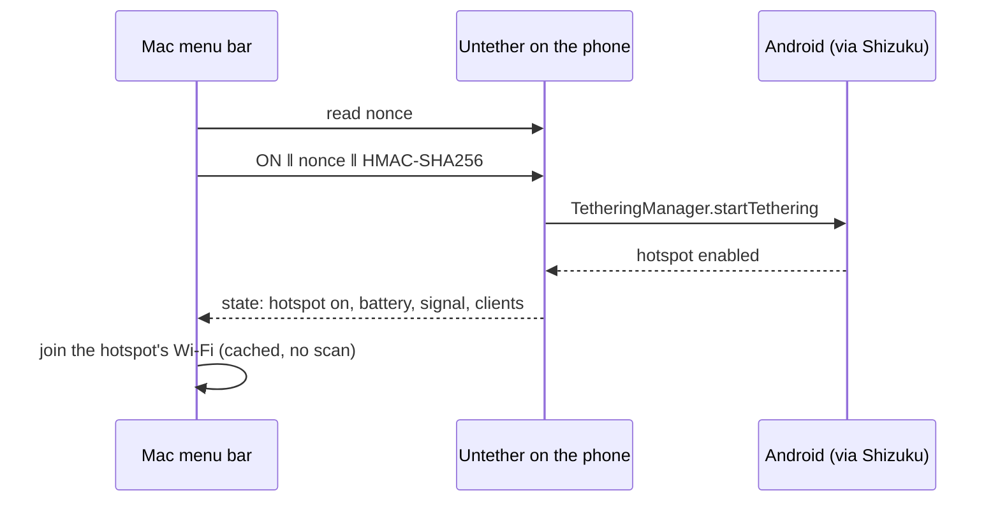

<p align="center">
  <picture>
    <source media="(prefers-color-scheme: dark)" srcset="docs/assets/banner-dark.svg">
    
  </picture>
</p>

<p align="center">
  
  
  
  
  
  
</p>

<p align="center">
  Instant Hotspot, but for Android. Click the icon in the Mac menu bar: the phone in your pocket
  turns on its Wi-Fi hotspot over Bluetooth, and the Mac joins it. About four seconds, no root.
</p>

<p align="center">
  
</p>

## What it does

- **One click, online.** The Mac asks the phone to start its hotspot and joins it straight away,
  without a Wi-Fi scan: about 4–5 s from click to internet.
- **The phone at a glance.** Battery and temperature, operator, network type (LTE, 5G NSA/SA),
  RSRP and SINR with live graphs, and the devices on the hotspot.
- **Control from the Mac.** Choose the SIM for mobile data, reconnect mobile data when it hangs,
  block a device on the hotspot, ring the phone when it is lost in the sofa.
- **And back.** The phone can ring the Mac.
- **Sensible defaults.** The hotspot turns off after a few idle minutes, a battery guard keeps it
  off below a chosen level, and the Mac can turn it off when it sleeps or leaves the network.
- **Survives real life.** Doze, reboots, phone app updates, Bluetooth restarts: both sides have
  watchdogs and reconnect on their own.
- **English and Ukrainian** on both sides.

<p align="center">
  
</p>

## How it works

The phone runs a small foreground service with a Bluetooth LE GATT server. It controls tethering
through [Shizuku](https://shizuku.rikka.app/), which runs the calls as the shell user, so no root
is needed. The Mac is a menu bar app in Go that stays connected to the phone over BLE.



The BLE protocol is documented in [`protocol/PROTOCOL.md`](protocol/PROTOCOL.md), design decisions
in [`docs/DECISIONS.md`](docs/DECISIONS.md).

## Security

- Every characteristic needs an encrypted, bonded BLE link (LE Secure Connections with numeric
  comparison on both screens).
- Every command is signed: `HMAC-SHA256(secret, op ‖ nonce ‖ arg)` over a one-time nonce from the
  phone. Without the 32-byte secret nothing can be switched, and a recorded command cannot be
  replayed.
- The secret and the hotspot password are generated on the phone and kept encrypted with an Android
  Keystore key. The Mac gets them once, inside a 60-second pairing window you open on the phone, and
  stores them in the macOS Keychain.

## Requirements

| | Needs |
|---|---|
| Phone | Android 17 (API 37) or newer, [Shizuku](https://shizuku.rikka.app/) running. Developed on a Pixel 9 |
| Mac | macOS 14+, Apple Silicon |
| Build | Go 1.26 and Command Line Tools; Android SDK 37.2 and a JDK |

## Install

**Phone**

```bash
cd android && ./gradlew :app:assembleDebug
adb install -r app/build/outputs/apk/debug/app-debug.apk
```

Open Untether, grant the permissions, allow it in Shizuku and let it ignore battery optimization.

**Mac.** Once, create a local signing identity so rebuilt apps keep their Keychain access:

```bash
macos/scripts/make-signing-identity.sh
```

```bash
cd macos && make install && open /Applications/Untether.app
```

Allow Bluetooth, and Location (macOS needs it to tell which Wi-Fi network the Mac is on).

**Pair once.** On the phone tap **Pair** in the Mac section; on the Mac open **Settings → Pair with
phone…**; confirm the same code on both screens.

## Development

```bash
cd android && ./gradlew :app:testDebugUnitTest   # protocol vectors, HMAC, CBOR
cd macos && make test                             # the same vectors from Go
adb logcat -s Untether                            # phone log
tail -f ~/Library/Logs/Untether/untether.log     # Mac log
```

The popover UI is plain HTML in `macos/ui/index.html`; open it in a browser to get a demo with fake
data (`?state=on&tab=network&lang=uk`).

| Path | What |
|---|---|
| `android/` | Kotlin, Jetpack Compose (Material 3): service, GATT server, Shizuku hotspot control |
| `macos/` | Go: BLE central, Keychain, Wi-Fi join, status item; popover UI in `macos/ui/` |
| `protocol/` | BLE protocol and golden test vectors shared by both sides |
| `docs/` | Design decisions, README assets |

## Limitations

- The Mac connects to the first phone that advertises the service.
- Turning the hotspot off on sleep or when leaving it needs Location permission on the Mac.
- Picking the data SIM needs two active SIMs.

## Credits

Hotspot control is written after [delta](https://github.com/supershadoe/delta) by supershadoe.
Uses [Shizuku](https://github.com/RikkaApps/Shizuku-API),
[tinygo bluetooth](https://github.com/tinygo-org/bluetooth) and
[Material Symbols](https://github.com/google/material-design-icons); see
[`THIRD_PARTY_NOTICES.md`](THIRD_PARTY_NOTICES.md).

## License

BSD-3-Clause © 2026 Oleksii Ostrovskyi. See [`LICENSE`](LICENSE).
